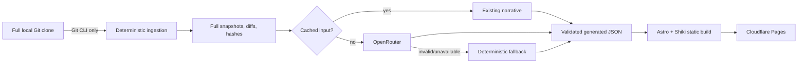

# LeetCode Solution History

A fully static Astro site that reconstructs every meaningful committed version of each `(problem ID, language)` solution in [the source repository](https://github.com/Kainoa-h/BOMBBOMBOBMOBOMBOMBOMBOMBBOMB). Revisions retain real chronology while OpenRouter optionally groups them into a separate narrative of algorithmic approaches.

## Architecture



The ingestion code under `scripts/` never executes source solutions and never uses the GitHub API to reconstruct history. Zod validates configuration, LLM output, and persisted files. `generated/` is authoritative state; GitHub caches are not.

## Requirements and setup

Use Node.js 22.12+ and pnpm 10.12+:

```bash
pnpm install
pnpm dev
```

The committed empty generated state builds without credentials. For a first ingestion, use a full clone:

```bash
git clone https://github.com/Kainoa-h/BOMBBOMBOBMOBOMBOMBOMBOMBBOMB source-solutions
pnpm ingest --source ./source-solutions --full --no-llm
pnpm build
```

Later runs are incremental and preserve cached narratives:

```bash
pnpm ingest --source ./source-solutions
pnpm ingest --source ./source-solutions --problem 1971 --language rust
pnpm ingest --source ./source-solutions --dry-run --verbose
```

If the recorded source HEAD is no longer an ancestor of the current HEAD, ingestion safely performs a complete re-index. Force this with `--full`. `--no-llm` creates a chronological “Solution history” approach and summaries from commit comments; an empty comment becomes “Updates the solution.” A failed model response never replaces a reusable cached narrative.

## OpenRouter

Set these only for semantic grouping:

```bash
export OPENROUTER_API_KEY=...
export OPENROUTER_MODEL=...
export OPENROUTER_BASE_URL=https://openrouter.ai/api/v1
export OPENROUTER_SITE_URL=https://your-site.example
export OPENROUTER_APP_NAME="LeetCode Solution History"
pnpm ingest --source ./source-solutions
```

Requests use Chat Completions structured output, local Zod validation, a 60-second timeout, and three bounded retries. Groups with only one revision bypass OpenRouter and use the deterministic fallback because there is no history to classify. Complete snapshots and relevant diffs are sent for larger groups. `PROMPT_VERSION` in `scripts/lib/schemas.ts` participates in cache identity; bump it after a material prompt change. Large histories currently use the provider context window; increase model context or ingest in no-LLM mode if a group exceeds it.

## Parsing and generated data

Subjects accept `[language]? ID[!]?: comment`. Missing language means Rust unless the file extension is stronger evidence. `!` remains visibly labeled “Marked incorrect by the author”; no failure reason is invented. Extension evidence wins conflicts and emits a recoverable warning. Titles come solely from the latest filename: source extension and `.solution` are removed, a leading ID is stripped, separators become spaces, and text becomes readable title case. A meaningless name falls back to `Problem <id>`.

Every unique code hash becomes one full revision snapshot. Consecutive content duplicates are omitted; metadata-only no-ops are not retained because their commit subject remains visible in Git. Deletions retain historical snapshots and mark the group deleted. JSON uses two-space stable formatting:

- `generated/problems/<id>/<language>.json`: page, approaches, full revisions, chronology, warnings, and analysis status.
- `generated/index.json`: canonical problem and language route index.
- `generated/manifest.json`: source HEAD, processed commits, input hashes, prompt/model status.
- `generated/ingestion-errors.json`: recoverable warnings and errors.

Narrative positions describe presentation inside an approach; timestamps and chronological positions always describe Git history.

## Configuration

Edit `config/site.json` before deployment, especially `siteUrl`; it controls canonical metadata and source links. Edit `config/favorites.json` to pin/unpin IDs. Favorites appear exactly in first-occurrence order, duplicates are ignored, and missing IDs produce a build warning without failing. This file is read directly by Astro, so favorites changes do not need ingestion.

To add a language, update the extension map, aliases, labels, and Shiki grammar in `scripts/lib/language.ts`, then add the grammar to `src/lib/highlight.ts`. To change models, update `OPENROUTER_MODEL`; changing model alone does not invalidate deterministic input, so use `--full` or bump the prompt version when re-analysis is desired.

## Automation and deployment

`validate.yml` runs lint, strict type checking, tests, generated validation, and the static build. `ingest-and-deploy.yml` accepts `repository_dispatch: leetcode-updated` and manual runs, checks out both repositories with full history, commits only changed generated files, and directly uploads `dist/` with Wrangler.

Create a Cloudflare Pages project (no Functions), give its API token Pages edit permission, and configure:

- Secrets: `OPENROUTER_API_KEY`, `OPENROUTER_MODEL`, `CLOUDFLARE_API_TOKEN`, `CLOUDFLARE_ACCOUNT_ID`.
- Variables: `CLOUDFLARE_PAGES_PROJECT`, optionally `OPENROUTER_SITE_URL`.

Copy `docs/source-repository-workflow.yml` into the separate source repository. Its normal `GITHUB_TOKEN` cannot generally dispatch to another repository. The simplest setup is a fine-grained PAT limited to the frontend repository stored as `FRONTEND_DISPATCH_TOKEN`; a GitHub App installation token is recommended long term. The dispatch contains only `source_sha` and `source_ref`, never code.

## Validation and troubleshooting

```bash
pnpm lint
pnpm typecheck
pnpm test
pnpm validate:generated
pnpm build
pnpm check
```

Malformed subjects and filename/language conflicts go to `generated/ingestion-errors.json` and do not stop other commits. An invalid LLM response is retried then falls back; check `[llm]` logs and verify the model supports structured outputs. After rewritten history, run `pnpm ingest --source ./source-solutions --full`. For Cloudflare failures, confirm project name, account ID, token Pages permissions, and that `config/site.json` has the production URL. Material assumptions: the primary source branch is `main` in the example workflow, Node 22 is the deployment runtime, and source files use a supported extension or recognized language directory.
